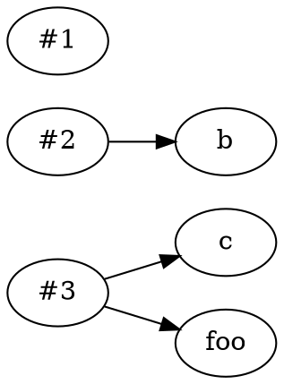
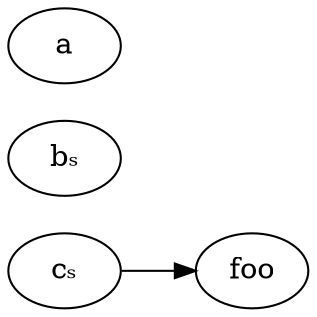

+++
title = "dirbuf.nvim"
description = "A file manager for Neovim which lets you edit your filesystem like you edit text."
weight = 1
page_template = "projects/page.html"
+++

[dirbuf.nvim] is a file manager I created for [Neovim]. It was created with the
idea of making creating, deleting, and moving files as easy as it is for text.

## Why did I create dirbuf.nvim?

In 2020, every file manager plugin I could find used what I call a
"command-style" of editing. That is if you want to create, copy, or delete a
file, you have to press some specific keystroke, run a special command, or click
a certain button to do that. In fact, *every file manager* I've seen uses this
method except for [vidir].

*Side Note:* I didn't actually learn about vidir until I had already implemented
most of dirbuf.nvim and was researching dependency-resolution algorithms.

This method works and is fairly simple to implement, but I've encountered a
number of issues with it: every plugin has a different set of mappings that
often only loosely match default Vim keybindings, meaning you have to memorize
more keybindings and remapping keys becomes more painful; input prompts often
appear far from your cursor and the file your manipulating which results in a
bumpier user experience; and you get a second-class editing experience where you
can't use dot-repeating, macros, or other plugins to help you automate your
change.

So my idea was that by creating a textual representation of a directory and
handing that directly to the user to edit, you could get a for more native and
intuitive experience. So creating a new line for a file would actually create a
new file, renaming a directory on its line would actually rename the directory,
and deleting a file's line would actually delete the file.

With this, you'd automatically work with whatever keybindings the users has,
completely support any current and future text-editing plugins, and get one of
the best batch renaming tools in the world with the full on-the-fly power of
Neovim at your disposal.

## How does dirbuf.nvim work?

From a user's perspective, dirbuf.nvim appears fairly simple. When you want to
use dirbuf.nvim to make some changes, here's the sequence of events from your
user-level perspective.

1. You open a directory and get a text buffer containing a list of files,
   directories, symlinks, etc. in that directory.
2. You make whatever edits you like to the directory buffer. Maybe you rename a
   few lines by editing their text, copy some others by copying their lines,
   delete a few few by deleting their lines, and make some new ones by creating
   new lines.
3. You save the directory buffer to make your changes and then close the buffer.

By design, dirbuf.nvim is only active in steps 1 and 3. This is important
because it means step 2, where all the edits happen, is a completely open box
where the user can do whatever they want in any way they want, giving them the
full power of Neovim and any plugins they have installed.

However, this means that whenever dirbuf.nvim wants to sync a directory buffer
with the filesystem, it has to somehow figure out what changed between step 1
and step 3. So let's break down how dirbuf.nvim does this.

### Step 1: Snapshotting & Displaying

In step 1, dirbuf.nvim scans the directory for filesystem entries. This gives us
a list of what we call `FState`s, which are tables with a `path`, `fname` (the
tail of the path), and an `ftype` ("file", "directory", "symlink", etc.).

dirbuf.nvim generates a unique id for each `FState` It then stores these
`FState`s by their ID in a map. We use a map so we can easily lookup `FState`s
in step 3. It then writes these `FState`s out to the directory buffer so the
user can edit them.

So for example, given a file directory like this

```
.
├── a
├── b
├── c
└── d/
```

You get a directory buffer like this.

```
#00000001	a
#00000002	b
#00000003	c
```

### Step 2: User Edits

Using our example from above, after several edits, the user ends up with the
following directory buffer.

```
#00000002	b
#00000003	c
#00000003	foo
bar/
```

We can see, after whatever edits the user did, the result is they deleted `a`,
copied `c` to `foo`, deleted `d/`, and created `bar`.

Satisfied with these changes, they save the directory buffer or call
`:DirbufSync`.

### Step 3: Syncing

Now that the user has saved the directory buffer, dirbuf.nvim parses every line
in the buffer into a FState. Any line with an ID is associated with the
corresponding FState in the snapshot. Any line without an ID is considered a
new entry.

This association or "linking" of parsed FStates with snapshotted FStates is a
generalization of moving, copying, and deleting filesystem entries which allows
dirbuf.nvim to figure out what the user "meant" by a series of changes. So if a
snapshotted FState has no associated parsed FState, it's been deleted. If it has
one linked FState, it's either been moved or left unchanged. And if it has
multiple links, it's been either copied or copied and moved.

We can visualize these associations in the following diagram, using the earlier
example with snapshotted FStates displayed by their ID. Note that we are
intentionally leaving off the new entry of `bar/`.

<!--

-->

{{ figure(src="graph1.svg", title="Example FState Association Diagram") }}

Dirbuf internally uses a data structure very similar to this FState association
diagram called a change map. It makes a few tweaks to the FState association
diagram to make it easier to convert to an efficient series of actions in future
steps.

Namely, it doesn't store self-links, that is where we would associate an FState
with itself, and instead sets `stays` flag to true, denoted here by subscript s.
This prevents self-copies and allows us to easily identify cases where we can
convert a copy to a move. The change map also identifies old entries by their
filename rather than their ID, which makes dependent changes easier to identify.

<!--

-->

{{ figure(src="graph1a.svg", title="Example Change Map") }}

TODO: Discuss dependency resolution algorithm and future work

[Neovim]: https://github.com/neovim/neovim
[dirbuf.nvim]: https://github.com/elihunter173/dirbuf.nvim
[vidir]: https://github.com/trapd00r/vidir
[vim-dirvish]: https://github.com/justinmk/vim-dirvish
